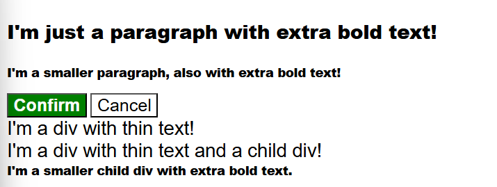

# CSS Foundations

## Intro to CSS
- CSS: cascading style sheets
- syntax: 
- `<div></div>` : this is a container
- Selectors:  refers to the HTML elements to which CSS rules apply
- universal selector `*` : will select all the elements of a type
- ```
    *{
  color: purple;
    }
  ```
- type selector selects all elements of a type
- ```
    /* styles.css */
    div {               <!-------this is a type selector------>
    color: white;
    }
  ```
- class selector selects all elements with the given class
- ```
    <!-- index.html -->
    <div class="alert-text">Please agree to our terms of service.</div>
  ```
- ```
    /* styles.css */

    .alert-text {
    color: red;
    }
  ```
- ID selectors: They select an element with the given ID
- ```
    /* styles.css */
    #title {
    background-color: red;
    }
  ```
- you can chain and group selectors
- few properties:
  1. color
  2. font-family
  3. text-align
  4. height and width
- adding css to HTML:
    ```
    <!-- index.html -->
    <head>
      <link rel="stylesheet" href="styles.css">
    </head>
    ```
### Assignments
- 
- 
- 
- 
- 

## The Cascade

- 1. Importance: Inline styles and !important declarations.
  2. Specificity: ID > Class/Pseudo-class/Attribute > Type/Pseudo-element.
  3. Source Order: The rule written last in the code has higher priority if specificity and importance are equal.
### Assignments
-  

## Inspecting HTML and CSS
- Inspector: To open up the inspector, you can right-click on any element of a webpage and click “Inspect” or press F12
- Styles panel also allows you to edit styles directly in the browser.

## The Box Model
- Every single thing on a webpage is a rectangular box.
- 

## Block and Inline
- 1. Block Elements: Always start on a new line, taking up the full width available (if width is not explicitly set).
  2. Inline Elements: Do not start on a new line and only take up as much width as needed for their content.
- normal flow (also known as document flow) is the default way that HTML elements are laid out on a page before any CSS positioning, floating, or flex/grid properties are applied.
- 