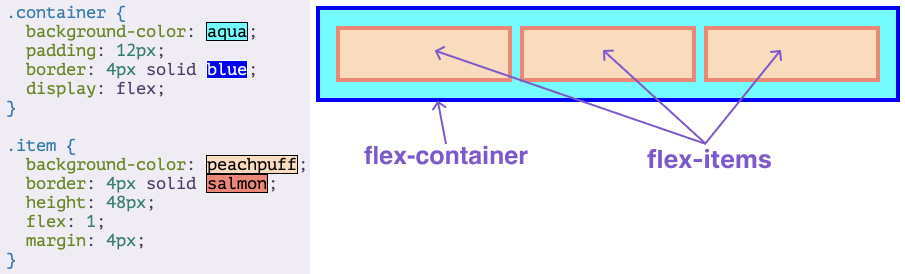
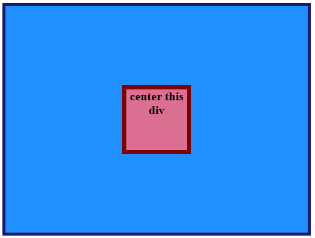
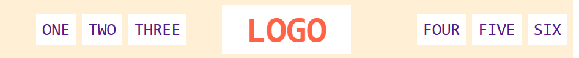
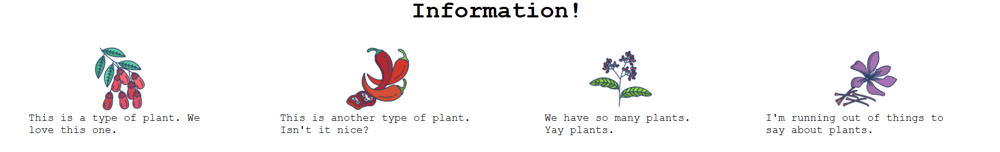
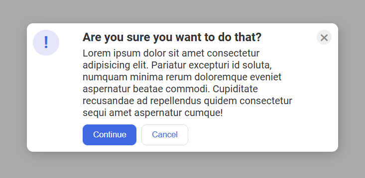
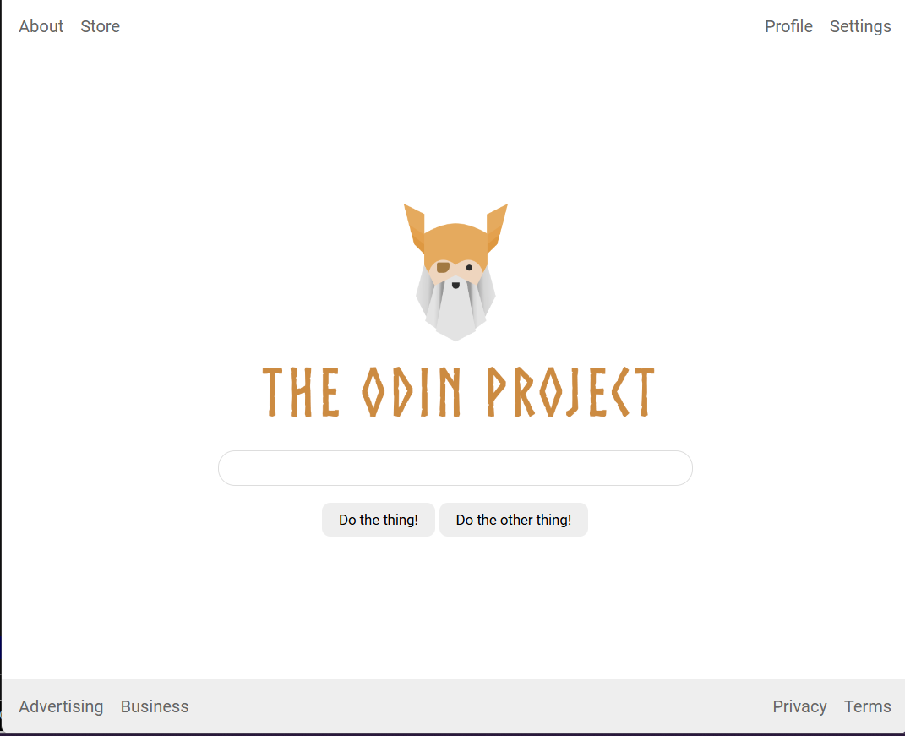
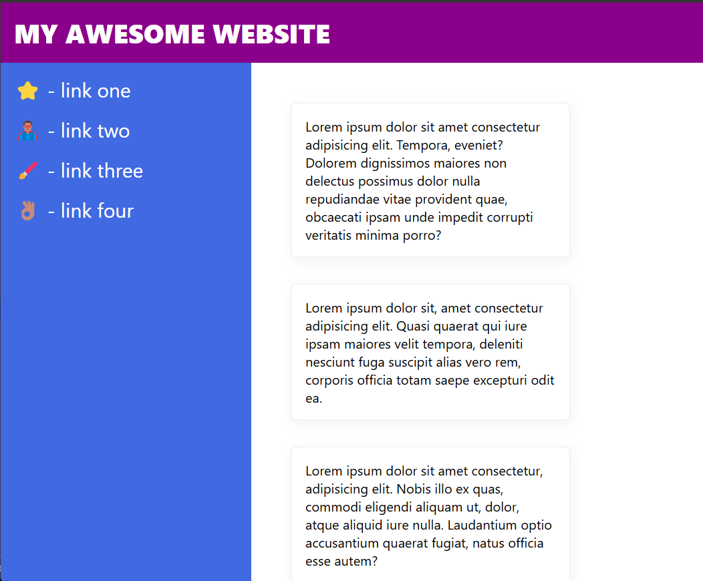

# Flexbox

## Intro to Flexbox
- Flexbox is a way to arrange items into rows or columns
- A flex container is any element that has `display: flex` on it
- flex item is any element that lives directly inside of a flex container.
- 

## Growing and Shrinking
- `flex` is actually a shorthand for flex-grow, flex-shrink and flex-basis
- ```
    div{
    flex: 1; 
  }
  ```
- `flex: 1` equates to: `flex-grow: 1`, `flex-shrink: 1`, `flex-basis: 0`
- 
  1. `flex: 1` Equivalent: When using `flex: 1`, it defaults to `flex-grow: 1`, `flex-shrink: 1`, and `flex-basis: 0`. This makes items grow equally to fill the container space.
  2. `flex-grow`: This property sets how much an item should grow relative to others. For example, if an item has `flex-grow: 2` while others have `flex-grow: 1`, it will grow twice as much as others.
  3. `flex-shrink`: This determines how much an item should shrink if there isn’t enough space. Setting `flex-shrink: 0` prevents an item from shrinking.
  4. `flex-basis`: This sets the initial size of a flex item. If set to 0, the item ignores any width value. The default is auto, meaning it respects the item's defined width.
  5. `flex: auto` Shorthand: Using `flex: auto` is equivalent to `flex-grow: 1`, `flex-shrink: 1`, and `flex-basis: auto`. This is different from the default `flex: 1` shorthand, which sets flex-basis to 0

## Axes
- flexboxes can work either horizontal or vertical using `flex-direction`
- `flex-direction: row` arranges items horizontally
- `flex-direction: column` arranges items vertically
- `flex-direction: row` is simpler because block elements naturally take full width. flex-direction: column can require additional height settings, as elements default to content height.

## Alignment
- `flex: 1` on .item makes items grow to fill available space
- `justify-content:` This aligns items along the main axis
- `align-items:` This aligns items along the cross axis
- Changing `flex-direction` affects `justify-content` and `align-items` by swapping their alignment directions
- The `gap` property is a newer, convenient way to add spacing between flex items without needing to add margin on each item.

## Assignments
- 
- 
- 
- 
- 
- 
- 