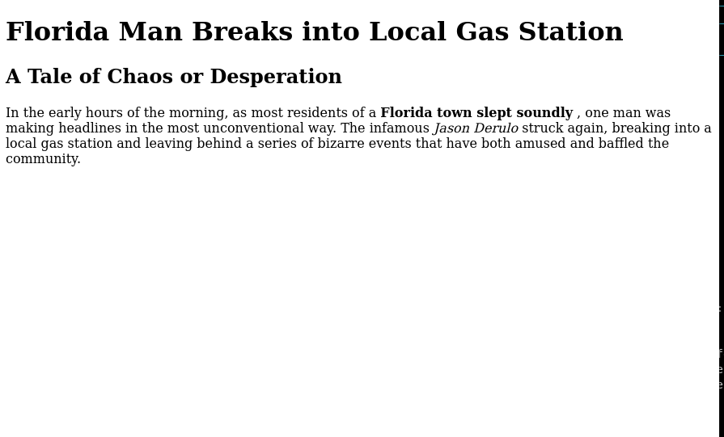
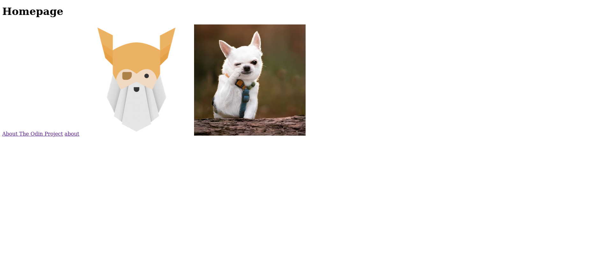

# HTML FOUNDATIONS

## Introduction to HTML and CSS
- HTML : hypertext markup language
    1. It is the raw data that a webpage is built upon
    2. HTML puts information on the webpage

- CSS : cascading sytle sheets
    1. It is what adds style to those plain elements.
    2. CSS positions the information, gives it color, changes the font, and makes it look great.

- Javasctipt : it the language which is made to do things on the webpages

## Elements and Tags
- HTML tags : they are keywords that define how content should be structured
    1. `<tagname>` : this is an opening tag
    2. `</tagname>`  :this is a closing tag
    3. example : `<p>some text content</p>`
    4. some tags are self closing , for eg `` they are also called void elements.
 - HTML elements: refers to everything from the opening tag to the closing tag, including the content in between. It is the fundamental building block of an HTML page.

## HTML Boilerplate
- Creating an HTML File and Boilerplate
- Create a New Folder and HTML File
    1. Create a new folder named `html-boilerplate`.
    2. Inside that folder, create a file named `index.html`.
    3. The filename should end with `.html` to be recognized as an HTML file.
    4. Naming the homepage file `index.html` is important, as web servers look for this by default.
- Doctype Declaration
The first line of every HTML file should declare the document type (DOCTYPE) to indicate the version of HTML being used.
- HTML5 uses the following doctype:
```html
<!DOCTYPE html>
 ```
 - include the `<html>` element. This wraps all the other elements on the page.
 ```
    <!DOCTYPE html>
    <html lang="en">
    </html>
```
- The `lang `attribute specifies the language of the document's content.

- add the head element
```
    <head>
        <meta charset="UTF-8">
        <title>my first webpage</title>
    </head>
```
- Add the Body Element
```
    <body>
        <h1>hello world</h1>
    </body>
```
- the complete boiler plate code:  
- the website live: 

## working with text
- HTML compresses whitespace, so it appears as one long line. To create paragraphs, wrap the text in `<p> `tags
- Headings are used to signify sections of content and come in 6 levels: `<h1>` (largest) to `<h6>` (smallest). 
- The `<strong>` element makes text bold and marks it as important.
- The `<em> `element makes text italic and adds emphasis, which also affects screen readers.
- HTML elements can be nested within each other, forming parent-child relationships. 
- Comments are invisible to users and used for leaving notes in the code. They are written like this:
```
<!-- This is a comment -->
```
- [working with text assignment](working_with_texts/working_with_text.html)
- the website live: 

## lists
- Ordered Lists
    1. Use `<ol>` to create a list where the order matters, like step-by-step instructions.
    2. Each item is wrapped in `<li>` and will be numbered.
- Unordered Lists
    1.  Use `<ul>` to create a list where the order of items doesn't matter, like a shopping list.
    2.  Each item in the list is wrapped in the `<li>` element, and displayed with bullet points.
- [lists assignment](lists/list.html)

## links and images

- Create a new directory named odin-links-and-images.
- Inside this directory, create an index.html file.
- Fill in the HTML boilerplate and add the following `<h1>Homepage</h1>`
- To create a link, use the `<a> ` element` <a>About The Odin Project</a>`
- To make it functional, add `href ` attribute   
`<a href="https://www.theodinproject.com/about">About The Odin Project</a>`

- To open links in a new tab, use the `target="_blank"` and pair it with `rel="noopener noreferrer"` for security reasons

- Absolute Links: Links that contain the full URL and Relative Links: Links to other pages within the same website without using the full URL.
- To display an image, use the `` element. Create an images/ directory and add a file called dog.jpg. Add the image to index.html
- Always include the alt attribute for accessibility and width and height attributes to define the size

- [the project](odin-links-and-images)
- the live website: 


## commit messages
- how to write good commit messages
    1. It Should Be Brief but Descriptive
    2. Limit the subject line to 50 characters
    3. Capitalize the subject line
    4. explain why and what

## Project Recipes
- I have created a website that has an index page with links to 2 pages and each page contains the recipe for a dish
- [Odin Recipes](https://goutham100.github.io/The-Odin-Project/HTML_Foundations/odin-recipes/index.html)
- [code](odin-recipes)


